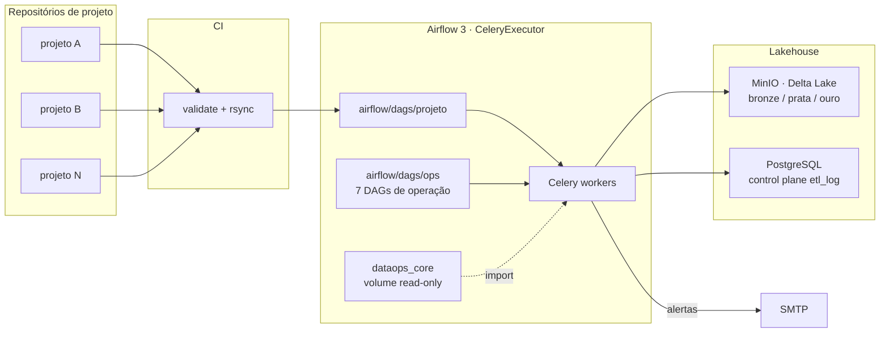

# Airflow Data Platform

Plataforma de orquestração para um lakehouse on-premises: imagem Docker do
Airflow 3, Compose, **biblioteca compartilhada (`dataops_core`)** usada pelos
pipelines e **DAGs de operação** que cuidam da saúde do Delta Lake e do object
store.

## Componentes

| Componente | O que faz |
|---|---|
| `dataops_core` montada read-only no worker | Lib única com notify, clean, security (PII), watermark e Delta I/O |
| Testes de contrato da API pública | pytest, sem Airflow/SMTP; verificam nomes de função e parâmetro |
| `dataops_core.require("x.y.z")` | Falha o parse da DAG se a versão da lib no worker for anterior à exigida |
| **7 DAGs de operação** (`airflow/dags/ops/`) | Health diário de buckets/tabelas, vacuum semanal, OPTIMIZE, limpeza de `_delta_log`, lifecycle MinIO, relatório de crescimento e relatório diário de falhas |
| Health Delta com **13 tipos de alerta** | Crescimento, small files, excesso de arquivos, histórico longo, taxa de commits, tabelas efêmeras, objetos fora do Delta, paths temporários, erros de varredura |
| E-mail com 4 modos | Falha, qualidade (warn-only), indicadores em atenção e resumo de execução, no mesmo layout; erro resumido e stack no log |
| Watermark | `watermark_to = MAX(coluna de negócio)`; janela com sobreposição; America/Sao_Paulo na API, UTC no `etl_log`, NTZ na escrita Delta |
| Escrita Delta | MERGE idempotente com retry em conflito de commit; colunas `void/null` convertidas para string; alinhamento de schema e `timestamp_ntz` automático |
| Segurança | Segredos por arquivo (`/run/secrets`), proxy Nginx, TLS com CA própria para o object store |

## Arquitetura



## Stack

- Airflow 3.2.2, CeleryExecutor, FAB auth, proxy Nginx
- PostgreSQL 17 (metadata) + Redis 7
- Oracle Instant Client (fontes Oracle)
- `deltalake` (delta-rs) + `pyarrow`, sem Spark nos jobs de plataforma
- `boto3`, `duckdb`, `pandas`, `psycopg2`

## Estrutura

```
Dockerfile docker-compose.yml nginx.conf airflow.cfg
sitecustomize.py          # hardening do API server em runtime
webserver_config.py
requirements.txt          # com constraints do Airflow
requirements-jobs.txt     # overlay sem constraints (delta-rs, pyarrow)
airflow/dags/ops/         # DAGs de manutenção
airflow/libs/dataops_core # lib compartilhada
airflow/libs/tests/       # contrato + comportamento (pytest)
postgres/pg_hba.conf
```

DAGs de domínio ficam em `airflow/dags/<projeto>/`, publicadas pelo CI de cada
projeto.

## Como rodar

```bash
# 1. Testes da lib (não precisam de Airflow)
pip install pytest unidecode pandas pyarrow deltalake psycopg2-binary boto3
pytest airflow/libs/tests -q

# 2. Imagem (os zips do Oracle Instant Client vão em plugin/, fora do Git)
docker build --build-arg AIRFLOW_VERSION=3.2.2 -t airflow-platform:local .

# 3. Ambiente: crie o .env e os arquivos de segredo em .env_secrets/
docker compose --env-file .env up -d --no-build
```

Acesso via Nginx na porta **8080**. Sem credencial, `GET /api/v2/dags` responde
`401`.

Documentação detalhada: [`airflow/libs/README.md`](airflow/libs/README.md) ·
[`airflow/dags/README.md`](airflow/dags/README.md) ·
[`airflow/libs/CONSUMIDORES.md`](airflow/libs/CONSUMIDORES.md).
